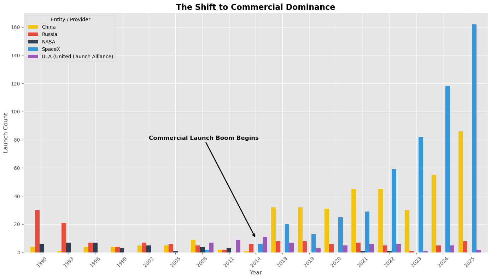
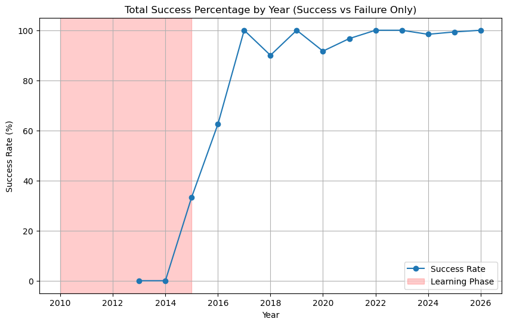

# Space Launch Project

#### The space launch industry has started to grow at an exponenetial rate. This graph signifies that the industry is changing and entering a new form of Space Race.

#### Below is a graph of the projected Space Launch growth on each coast projected out to 2030.

#### Here is also a graph showing the increase in heavy payloads being launched into orbit at a higher rate.

#### Why is mission assurance important?

#### Mission Assurance is an intergral part of reliablility in space travel. Below is a graph with the percent of success and errors for SpaceX launches from 2010-2026

#### As you can see space travel is a safe as it's ever been. But mishaps still happen. This is why it is important to stay engaged and do our part to further safen space travel when providing mission assurance at the pad.

## Please check out the Streamlit app for predictions on manpower and what is needed per mission. The manpower prediction model is based on the number of important tasks and the number of missions happenning simultaiously. 

## Our recommendations 

#### Integrating the need for heavy-lift infrastructure
#### Based on this data we are seeing a surge in heavy payloads at the Cape. to support these requirements, we are suggesting that new pads are able to support the future use of Falcon Heavy and starship

#### We also recommend having more payload process facilities for processing more and heavier satellites

#### Maximize MAT Capacity and Readiness via Predictive Manpower Modeling
#### "Identify Operational 'Red Zones' : Utilize the manpower model to identify 'Red Zones'—specific mission where the predicted headcount exceeds 90% of the squadron’s MAT and Reasonable Engineer capacity.

#### Having every capable member of the squadron MAT-qualified, we can ensure additional personnel are available to perform MAT duties as needed.

#### When we identify a Red Zone, leadership can initiate early requests for augmentees from other squadrons, ensuring that mission assurance coverage are met during high-density launch periods."

